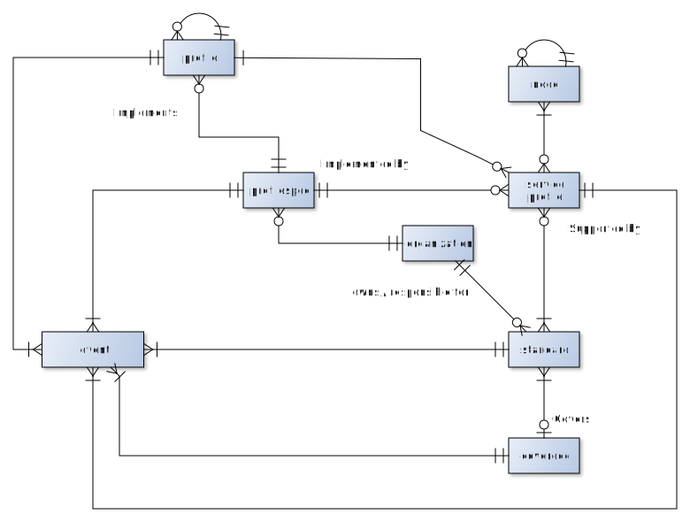

# NISP Wiki data model

This repository contains the specification *model.xml* and import stylesheets necessary to build a semantic wiki implementation of the NISP database.

The Wiki data model is almost a one-to-one mapping of the concepts used in the [XML based data model](https://stavnstrup.github.io/nisp-tools/nisp-database-schema.html) with a few exceptions:

* Only the core concepts i.e. *Profile*, *Service Profile*, *Standard*, *Cover Document*, *Profile Specification*, *Organization* and *Taxonomy Node* are implemented.
* XML elements, which are either container elements or elements created for usability reasons have not been implemented, as they do no contribute to the data-model and are therefore unnecessary in the Wiki model.
* In the XML version of the NISP DB, we never delete standards or profiles, but only mark elements as deleted. We have not ported any deleted elements to the Wiki platform, but the historical elements will continue to be available [here](https://nisp.nw3.dk/).
* All the child elements except *substandards* of the *document* element used by the *standard* element are not transferred to the Wiki. But of course the attributes of the document element are ported to the Wiki.

The document element is described in the XML DTD as

~~~{.dtd}
<!ELEMENT document (substandards?, correction*, alsoknown?, comment?)>

<!ATTLIST document
          orgid   CDATA #REQUIRED
          pubnum  CDATA #REQUIRED
          date    CDATA #REQUIRED
          title   CDATA #REQUIRED
          version CDATA #IMPLIED
          note    CDATA #IMPLIED>
~~~

N.B. one major difference between the two data models is that almost all attributes have changed name. This reason for this change is:

* Very few IP CaT members knew anything about the old data model and are therefore not affected by the change.
* The new vocabulary is identical to the vocabulary used in the EM-Wiki and are therefore familiar to users of the EM-Wiki.

# Core concepts

All the core concepts in Wiki are described below:

In order to see the different concepts in the NISP Wiki, you should open the wiki and search for the page **project:Data Browser**. All words in this note marked in bold, can be found in the Wiki.

## Simple concepts

The *Organisation*, *Taxonomy Node*, *Cover Document*, *Profile Specification* and the *Standard* concept are straightforward and requires little explanation:

* *Organizations* describe all organizations in the database. An organization can *own* a standard and another organisation is *responsible party* for a standard. A *responsible party* is therefore an organization, who takes the role as subject matter expert for a specific standard on behalf of NATO.
* *Taxonomy Nodes* are nodes in the [C3 Taxonomy](https://www.nato.int/cps/en/natohq/topics_157573.htm?). We currently only use a subset of the nodes in the Taxonomy.
* *Cover Document* are a special NATO concept used to cover one or more NATO standards.
* *Profile Specification* is a concept describing a document which contains a textual representation of a profile. There will therefore exists a link from the *profile* and the *service profile* to the *profile specification* element.
* *Standards* are the most important part of the NISP database and describes all standards used by one or more profiles.

## Profiles

Profiles in NISP comes in two flavours:

* The *Basic Standards Profile* (BSP) which currently is presented as the *mandatory* standards in volume 2 and the *candidate* standards in volume 3.
* Community Of Interest (COI) profiles, which are modelled using the concepts *Profile* and *Service Profile*.

Since NISP 12 the BSP and COI profiles have been consolidated, and the result have been the elemination of the datastructures used to describe the BSP, which is now represented by a profile where the id attribute has the value *bsp*.

### Basic Standards Profile

The *Basic Standards Profile* is in NISP Vol 1 described as: "The Basic Standards Profile specifies the technical, operational, and business standards that are generally applicable in the context of the Alliance and the NATO Enterprise". We present this as mandatory standards in volume 2 and candidate standards in volume 3.

In the XML version the *Basic Standards Profile* consists of one or more of the *Basic Standards Service Profile* element. We only implement the later in the Wiki, since that is all that is necessary. Each *Basic Standards Service Profile* element therefore describes the mandatory and candidate standards for a specific taxonomy node. In volume 2 and 3 we list the taxonomy nodes and recommended standards. An example on this can be found [here](https://archive.nisp.nw3.dk/nisp-9.0/volume2/ch03s02.html). Note that in NISP 9 we used to list both mandatory and candidate (at that time called emerging) standards in the same document.

An Wiki example of a Basic Standards Service Profile is the profile used for **Informal Messaging Services**.

Currently a responsible party typically recommends, if a standard should be registered as mandatory or candidate standard for one or more taxonomy nodes. Since this might cause implementation specific issues of systems, it is therefore the goal that is model is dropped, and that we instead have a single responsible party for a *Basic Standards Service Profile*, which therefore only contains the minimum set of standards necessary to implement the functionality of a given taxonomy node. We have therefore added the attribute *Responsible* to the concept, which at the moment is left undefined.

### Community of Interest profiles

A COI profiles such as e.g. the Federated Mission Networking (FMN) profile is implemented as a tree structure. A profile may therefore be composed of a number of subprofiles and each of those subprofiles may as well be composed of a number of profiles. In NISP with use two slightly different profile concepts to implement the tree. The two profile concepts are *Profile* and *Service Profile*.

We use these concepts in the following way:

* The *Service Profile* concept represents the leaves of the tree.
* The *Profile* concept represents all the other nodes in the tree.

The profile representing the root node have a special attribute *toplevel* set to the value *yes* and is also called the *capability profile*. The implementation of a capability profile for FMN Spiral 2 can be found [here](https://nisp.nw3.dk/capabilityprofile/fmn2.html). You can see the whole tree, if you click on the "Topography" tab, or you can traverse down the tree clicking on the sub-profile links.

The same concepts are also implemented in the Wiki, see **Fmn2** for an example of the FMN Spiral 2 implementation.

Currently, we do not present FMN 2 in the NISP documents, but only links to the canonical specification. In NISP version 9, we did render a version of the [FMN Spiral 1.1 profile](https://archive.nisp.nw3.dk/nisp-9.0/volume3/apgs03.html). The visual presentation of all capability profile is automatically implementef for all capability profiles when you click on the "Table" tab.

The *Profile* element is basically just a container element, and is only used to group standards. Each profile have a least one profile element which then consistutes the root of the profile tree.

The essential element in a profile is the **service profile** element. This profile maps standards to nodes in the taxonomy.

MORE TEXT HERE - INCOMPLETE DESCRIPTION. WE NEED TO DESCRIBE THAT A SERVICE PROFILE REPRESENT TWO DIFFERENT SEMANTIC CONCEPTS.

# Naming conventions

In the Wiki each instance of a concept is implemented as a page. We therefore need a convention on how to name the individual pages. Most objects have an id in the XML database, but often they are to cryptic to use. Therefore the following conventions are used:

* Each standard use it's id to name the page.
* Each capability profile, profile and service profile use the title of the profile.
* The basic standards service profiles do not have an id Instead they are named using the taxonomy node title prefixed with 'BSP-'.
* Taxonomy nodes use the title as name.
* Organizations use a capitalized form of their name.

These convention does not have to be followed, but a consistent approach makes the users life much easier.

# What has not been implemented

Two of the concepts *Catalog Items* and *Cover Documents*, which originally was part of the draft data model, have not been implemented. The main reason is lack of experience with the data modelling language, but also because these concepts are not part of the NISP XML implementation.

# TO DO

* Create meaningfull description of all concepts and profiles.
* Create helptext for all properties - this is accomplished through the instruction element.
* In the XML data model some attributes of e.g. standards contained highly stucture data like paragraph and list. These structures have been retained, but a few constructs, such as footnotes and images is not part of the existing datamodel.

# Database refactoring

The data model is probably far from perfect and will therefore require significant refactoring. Experience also shows, that we quite often change the datamodel. IP CaT will therefore ASAP have to figure out the process and techniques on how to refactor the database. Refactoring the database requires that data can be extracted, transformed and imported again. This is also knowledge, we need to work the system.
